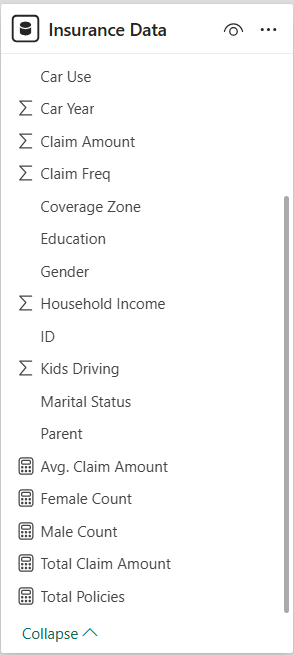
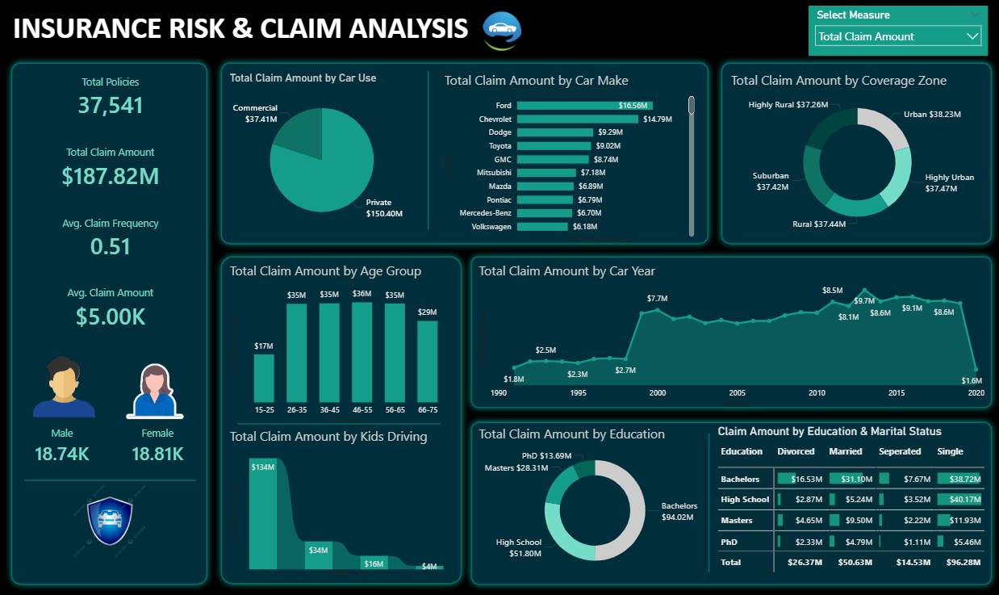
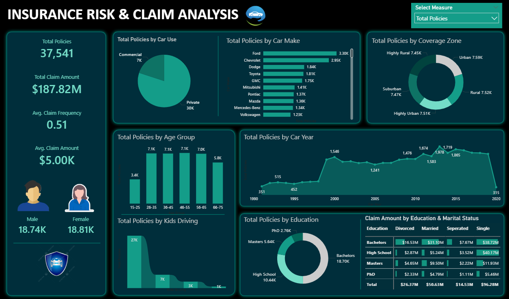
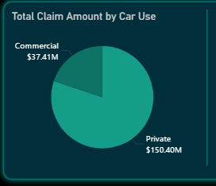
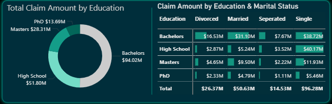
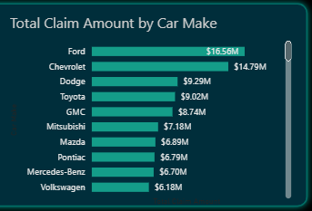
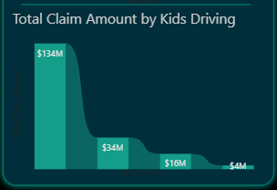

# Project Background & Overview
Insurance companies need to balance the money they collect from policies against the money they pay out in claims. This project analyzes **37,541 car insurance policies** to identify which groups of people or types of cars are the most "risky." By understanding these patterns, the company can set better prices for their policies and reduce high-cost claims.

**Key Business Questions:**
* What is the total claim amount, and how does it compare to the number of active policies?
* Which age groups and education levels are responsible for the highest claim costs?
* Which car makes (like Ford or Chevrolet) and car uses (Private vs. Commercial) result in the most claims?
* How does the coverage zone (Urban vs. Rural) and having kids who drive affect the risk of a claim?

# Data Structure Overview
The data is organized to track each policyholder's profile and their claim history.

* **Source:** Kaggle Public Dataset
* **Customer Profile:** Age Group, Gender, Education, and Marital Status.
* **Policy Details:** Car Make, Car Year, and Coverage Zone.
* **Financial Metrics:** Total Claim Amount, Claim Frequency, and Policy Count.

**Entity Relationship Diagram (ERD):**

# Executive Summary
The insurance portfolio consists of **37,541 policies** with a massive total claim payout of **$187.82M**. The average claim amount is **$5.00K**. While the gender split is almost perfectly equal, **Private car use** accounts for the vast majority of claim costs ($150.40M). Interestingly, drivers with **Bachelors degrees** and those in **Urban/Suburban** areas represent the highest volume of policies and claims.

**High-Level Metrics**
* **Total Policies**: 37,541
* **Total Claim Amount**: $187.82 Million
* **Avg. Claim Frequency**: 0.51 (About half of the policies have a claim)
* **Avg. Claim Amount**: $5,000
* **Gender Split**: 18.74K Male / 18.81K Female

**Total Claim Amount**

**Total Policies**

# Insights Deep Dive
### The "Private Use" Risk Factor
* Private car use accounts for **$150.40M** in claims compared to only **$37.41M** for Commercial use.
* Even though there are 30K Private policies, the claim amount is disproportionately high. Private drivers are the primary source of financial risk.

### Education and Marital Status Impact
  * People with **Bachelors degrees** have the highest claims ($94.02M). Within that group, **Single** individuals have the highest claims ($38.72M) followed closely by **Married** individuals ($31.10M).
  * Single drivers with higher education levels are surprisingly a very high-cost segment for the company.

### Vehicle Age and Make Trends
* Claims stayed low for cars made before 1998 but spiked significantly for cars made between **2000** and **2015**. **Ford** and **Chevrolet** are the top car makes for both policy volume and claim amounts.
* Newer cars (post-2000) result in much higher claim payouts, likely due to higher repair costs and more technology in the vehicles.

### The "Kids Driving" Drop
* Policies where **0 kids are driving** account for **$134M** in claims. The cost drops drastically as the number of kids driving increases (only $4M for 3+ kids).
* This suggests that the majority of our policyholders do not have children driving their cars, or that parents with driving children are much more cautious.
  

# Recommendations
* **Urban Pricing Adjustment**: Since Urban, Suburban, and Highly Urban zones all have claims over **$37M** each, consider increasing premiums for city drivers where accidents are more frequent.
* **Targeted Discounts**: Offer lower rates to **Married** policyholders with **High School or PhD** education levels, as their total claim amounts are significantly lower than the Bachelors group.
* **Car Make Strategy**: Review the risk levels for **Ford and Chevrolet** owners. Since they lead in claims, a slightly higher base premium for these makes could offset the high payout costs.
* **Vehicle Age Incentives**: Create specialized "Classic Car" or "Older Vehicle" (Pre-2000) insurance packages, as these show much lower claim risks compared to newer models.
